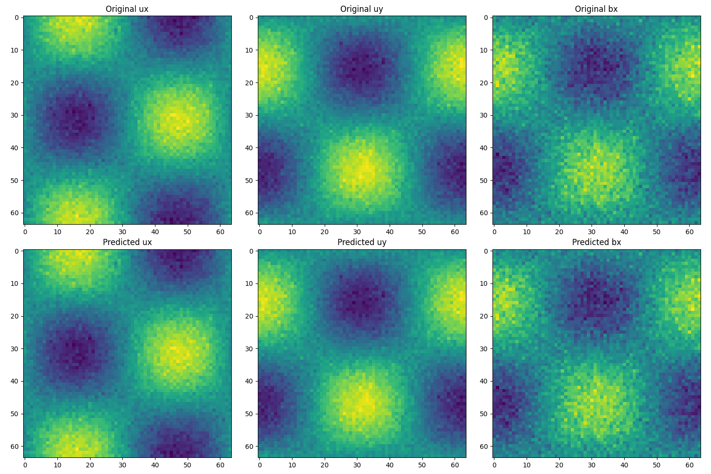
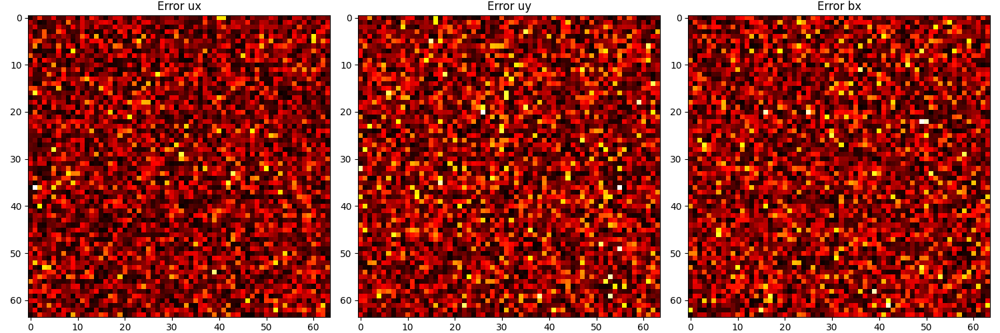

# Introduction

When I was just starting at the [Semeter Lab](https://heaviside.bu.edu) in October 2022, one of the first tasks assigned to me (which eventually became the first section of my thesis) was to do what is known to computer graphics scientists as [novel view synthesis](https://www.youtube.com/watch?v=yYKqNjIMhek) using different 2D spectra viewing the ionosphere.

As with most deep learning tasks, the trick to this challenge often lies in [data preprocessing](https://en.wikipedia.org/wiki/Data_preprocessing), choosing the right [architecture](https://en.wikipedia.org/wiki/Neural_architecture_search), [activation function](https://en.wikipedia.org/wiki/Activation_function), designing the right type of layer for the data you are processing, and designing the [loss function](https://en.wikipedia.org/wiki/Loss_function). When dealing with physical simulations, a natural choise is to start with a [Physics-Informed Neural Network](https://i-systems.github.io/tutorial/KSNVE/220525/01_PINN.html). There is no difference between an ANN and a PINN. ANNs are [universal function approximators](https://en.wikipedia.org/wiki/Universal_approximation_theorem) which are trained by [backpropagating](https://en.wikipedia.org/wiki/Backpropagation) errors through the entire network and updating the weight of each node. Many fields in deep learning are built on defining this loss function itself. The famous [YOLO](https://en.wikipedia.org/wiki/You_Only_Look_Once) algorithm is entirely a result of loss function engineering. While the idea itself predates machine learning, modifying the loss function and training for long enough with gradient descent gets you fairly accurate results in many scenarios.

The idea behind a PINN is to map a set of _input_ points to their _outputs_, where the output is decided as the result of passing each point through a solution of the physical system being modeled. The most common way to get the output is to map input points to the solution of a particular differential equation that the physical system is being modeled as. Since ANNs can fit any function if trained for long enough, PINNs are designed as a neural network that are trained for shorter time periods and generalize to solutions of the differential equation that are not seen in the training data. The way they do this is by adding the differential equation itself to the loss function.

This idea can be taken further. A [physics-informed neural _operator_](https://arxiv.org/abs/2111.03794) tries to generalize to the entire domain. Specifically, given an [operator](https://en.wikipedia.org/wiki/Operator_(mathematics)) $F:X \rightarrow Y$, the idea is to take some points from $X$ and their corresponding transformations from $Y$ and learn $F$. That is: given a neural network represented as a function $N(x), x \in X$, we want to make $N$ arbitrarily close to $F$. The resulting matrix multiplication that $N$ performs should be close to the transformation $F$, which may not be a matrix multiplication. The way you feed points from $X$ into $N$ is often modalities such as an image. In simple terms: If you have a video of waves in the ocean, the PINO should be able to predict where the wave is going (that is, where it is as time $t+1$) given only the picture of the wave (the current frame) at the current time $t$.

The way this is done is also very simple. The idea is to take a [Fourier transform](https://en.wikipedia.org/wiki/Fourier_transform) of the input data, multiply it by a randomly-initialized weight matrix, and take the inverse Fourier transform and compare the results. Your backpropagation will update the weight matrix itself. In practice, noise in your input data is high frequency, so the weight matrix is often initialized to favour lower frequencies in the Fourier-transformed-data. The loss function is often modified as well to include the physics-informed loss.

This is a very simple overview of an interesting topic. So far PINOs have found applications in CFD simulations. I, however, used them for [MHD](https://en.wikipedia.org/wiki/Magnetohydrodynamics) simulations. I modeled [STEVE](https://en.wikipedia.org/wiki/STEVE)-like phenomena and [plasma bubbles](https://en.wikipedia.org/wiki/Equatorial_plasma_bubble) in the ionosphere for novel-view generation and 3D reconstruction of the phenomena. This was done to answer some outstanding questions in ionospheric plasma physics; namely, what can we infer about the physical processes going on in the atmosphere if the phenomenon is so-and-so large?

## Plasma Bubbles

The graphs below show simulations of plasma bubbles at low resolution using a PINO with 3D spectral convolutions and physics-informed loss. Of note is that even at different resolutions the PINO's reconstruction errors are more or less distributed equally over the image, showing that the PINO can capture different scales

## STEVE MHD

A full STEVE-like simulation can be done with [Gemini3D](https://gemini3d.github.io/gemini3d/). I modeled the basic underlying phenomena and simulated them over lower resolutions and larger timescales. You can still see the underlying structure in the video.

For this, I used 2D spectral convolutions. The PINO didn't quite reconstruct the phenomenon because of the diffuse boundaries of ionospheric phenomena, which is what SIREN activations are designed for. I eventually ended up going with classical algorithms that helped me do a 3D reconstruction of STEVE.