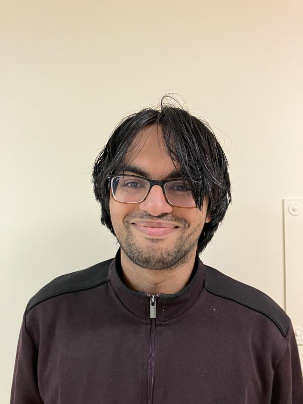

# Who I am

    

        
        

            I'm <b>Kshitij</b>. I work on automated stellar navigation at Absentia Technologies. I'm a May 2024 graduate from <a href="https://bu.edu">Boston University's</a> Master of Electrical and Computer Engineering program. As a student, I <a href="#STEVE-BU-work" title="Find out more here!">worked</a> in Boston University's <a href="https://heaviside.bu.edu">Space Physics Lab</a> from October 2022 to May 2024, advised by <a href="https://bu.edu/end/profile/joshua-semeter/">Joshua Semeter</a>. I also worked at the <a href="https://www.bu.edu/hic/">Hariri Center</a> for NASA's Life on Mars initiative, developing signal processing and machine learning techniques to analyze the Martian ionosphere and simulated GPS propagation through it. Previously, I was at <a href="https://www.coeptech.ac.in">COEP</a> from 2018-2022.
            

            I'm also a TA/mentor for <a href="https://cranephysics.org">CRANE</a> 2025's winter session, instructing students in computational plasma physics. I work on mechanistic interpretability in astrophysics at <a href="https://universetbd.org/">UniverseTBD</a>. Check out our first paper review <a href="https://www.youtube.com/watch?v=ZVO513Z8Uu0">here!</a>
            

        

    

# Links

    

        <a href="https://drive.google.com/file/d/14E6-Vjatom4QNnUgZxm6di7DzsScnQOB/view?usp=sharing" style="display: block; padding: 10px; margin-bottom: 10px; text-decoration: none; background-color: #f8f9fa; text-align: center; border: 1px solid #dee2e6; border-radius: 4px; transition: background-color 0.3s ease;">
            My Resume
        </a>
        <a href="https://linkedin.com/in/kshitij-duraphe" style="display: block; padding: 10px; margin-bottom: 10px; text-decoration: none; background-color: #f8f9fa; text-align: center; border: 1px solid #dee2e6; border-radius: 4px; transition: background-color 0.3s ease;">
            My LinkedIn
        </a>
        <a href="https://github.com/ksd3" style="display: block; padding: 10px; margin-bottom: 10px; text-decoration: none; background-color: #f8f9fa; text-align: center; border: 1px solid #dee2e6; border-radius: 4px; transition: background-color 0.3s ease;">
            My GitHub
        </a>
    

# Contact me
I can be emailed at kshitijd [at] bu.edu. Inspired by [Piotr Teterwak](https://cs-people.bu.edu/piotrt/) I am available for "office hours" (online or through video conferencing) each week to talk about anything you like. I have gone through Masters admissions and the post-COVID US STEM job hunt, and also defended a thesis, so I have some perspective on that as well as graduate student life. Email me with the subject line "OFFICE HOURS" and give me a brief overview of what you want to talk about. Ideally you should be an undergraduate or new (US) Masters student in some field relevant to EECS, but I am happy to talk with new grads and high schoolers as well.

# My interests

On the theory side, I'm broadly interested in astrophysics and currently studying the application of inverse methods to astrophysical phenomena. I hope to branch out into more applied [SciML](https://sciml.ai/) and develop faster and more reliable methods to understand these phenomena.

On the practical side, I'm interested in developing fast, efficient, and scalable multimodal signal and image processing systems to solve engineering problems in unstructured, noisy, and sparse scenarios. 

# Some things I've worked on

1. **(BU, 2022-2024):** A variety of investigations into the [STEVE](https://en.wikipedia.org/wiki/STEVE) phenomenon - fluid electrodynamic simulations, citizen science + scientific data-driven reconstruction, deep learning methods for automated detection systems. I defended a [Master's thesis](https://open.bu.edu/handle/2144/48878) in April 2024 (Committee: [Joshua Semeter](https://www.bu.edu/eng/profile/joshua-semeter/), [Yukitoshi Nishimura](https://www.bu.edu/eng/profile/toshi-nishimura/), [Michael Hirsch](https://www.bu.edu/eng/profile/michael-hirsch/)) on the latter two topics.
1. **(BU, 2023):** I worked on the NASA Life on Mars initiative at Hariri. I simulated EM propagation through Mars' ionosphere and developed models for detecting features on GNSS maps.
1. **(BU, 2024):** During the [April 8](https://en.wikipedia.org/wiki/Solar_eclipse_of_April_8,_2024) full solar eclipse, the Semeter Lab members went around New England and into Canada to record GNSS data from consumer cell phones. I helped take observations at MIT and Ogunquit, ME. A [poster](https://cedarscience.org/sites/default/files/2024-posters/IRRI-8-Nina-ServanSchreiber.pdf) was presented by [Nina Servan-Schreiber](https://www.linkedin.com/in/nina-servan-schreiber-68834321b) at the [2024 CEDAR Workshop](https://cedarscience.org/2024-workshop).
2. **(GaTech, 2024):** A VLM-LLM integrated end-to-end [system](https://github.com/ksd3/updatedWeb) that generates insurance recommendation reports using a combination of tenant complaints and photos taken by an insurance agent for [Hacklytics](https://hacklytics.io) 2024.
3. **(MIT, 2024):** Developed custom optimizers for [linear quantum photonic GANs](https://github.com/ksd3/biqermicefrommars) at [iQuHack-24](https://www.iquise.mit.edu/iQuHACK/2024-02-02).
4. **(MIT, 2023):** A [QCBM](https://github.com/ksd3/BeatQraft)-based music generator that won second place in the IBM x Covalent challenge at [iQuHack-23](https://www.iquise.mit.edu/iQuHACK/2023-01-27).
5. **(COEP, 2022):** Building a neutral hydrogen radio telescope [from scratch](https://github.com/ksd3/radio-telescope), advised by [Archana Thosar](https://www.coeptech.ac.in/faculty/prof-archana-g-thosar/).
6. **(IIT Bombay, 2021, BU, 2022):** Analysis of the binary star system [QX Cas](https://simbad.u-strasbg.fr/simbad/sim-id?Ident=V*%20QX%20Cas) with [PHOEBE](https://phoebe-project.org).
7. **(COEP, 2021):** Some [linear models](https://github.com/ksd3/radio-telescope) for solar power, advised by [Suhas Kakade](https://www.linkedin.com/in/suhas-kakade-a6691721/?originalSubdomain=in) and [Rohan Kulkarni](https://in.linkedin.com/in/rohan-kulkarni-35951566).

# Miscellaneous

- I keep a list of courses I took at BU along with my thoughts on them. The course name, number, and instructor might have changed since I took them. You can find the list [here](./courses.md).

- Check out some of my thoughts [here](./writing.md).

# What on the internet do I find interesting?

- [scivision.dev](https://scivision.dev): Michael Hirsch singlehandedly carries the GNSS community on his back with [Georinex](https://github.com/geospace-code/georinex/) and his website is full of useful tips and tricks for wrangling with C Compilers.
- [Dan Luu](https://danluu.com)'s website. Commentary on programming and tech-society.
- [The UCR Matrix Profile Page](https://www.cs.ucr.edu/%7Eeamonn/MatrixProfile.html): The best time-series page on the internet.
