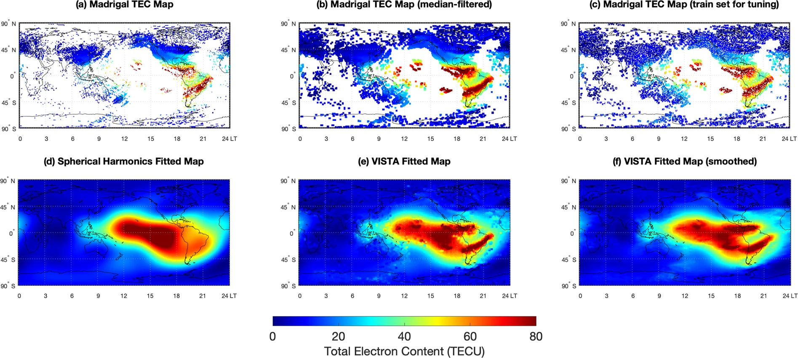
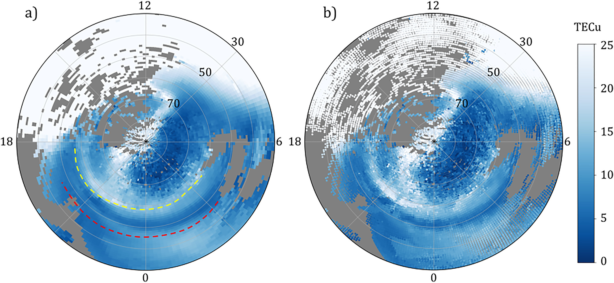
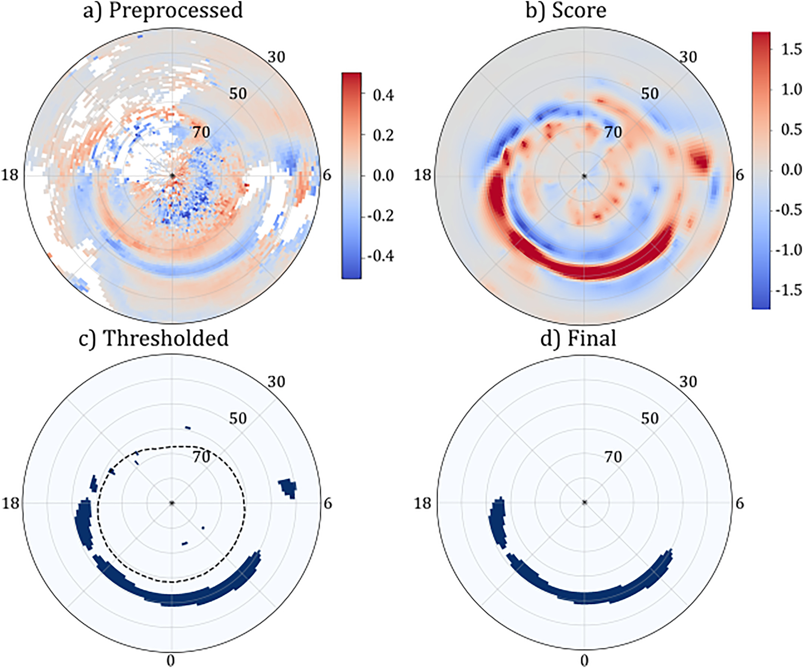
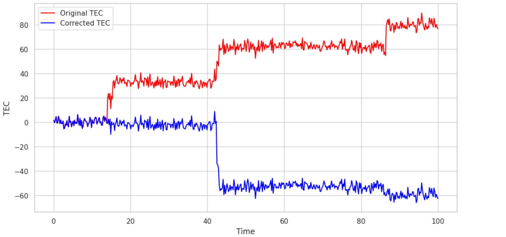
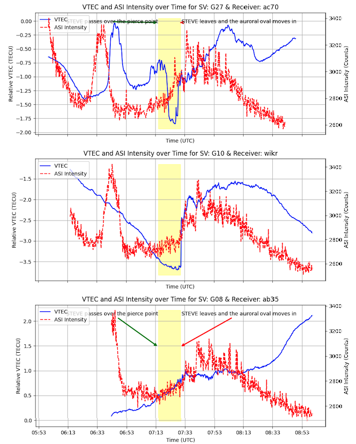
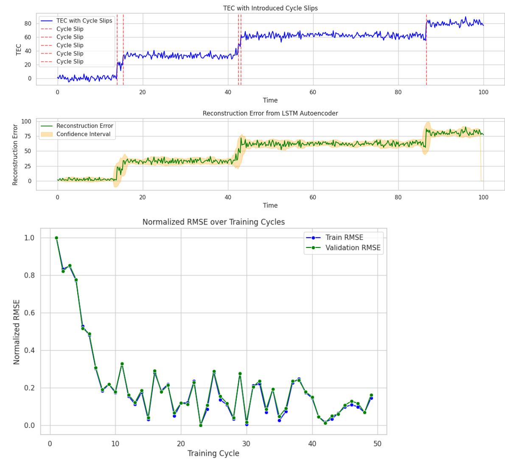
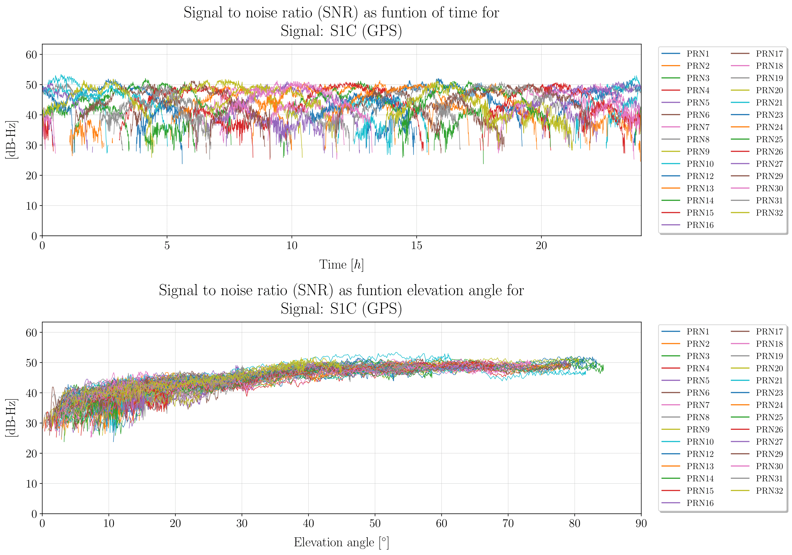
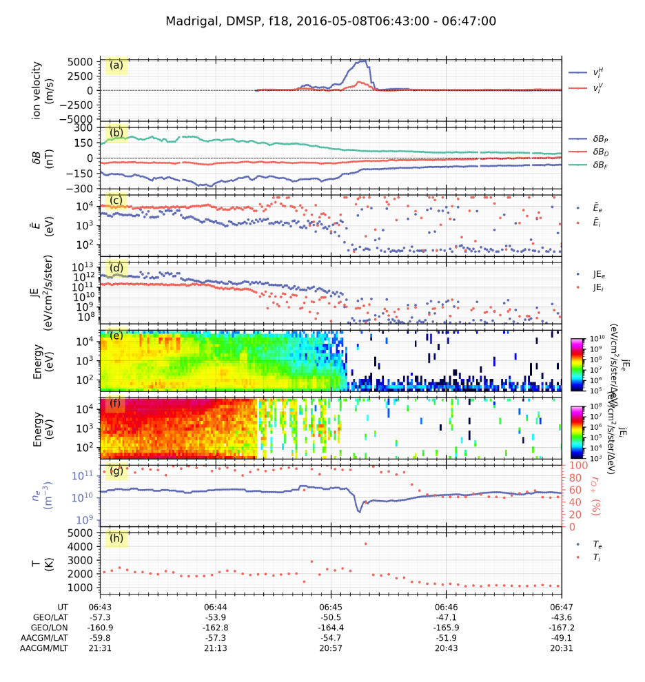

# Overview
1. [Algorithms](#algorithms)
    - [Data Processing](#data-processing)
        - [Ionospheric Assumption Validation](#1-ionospheric-assumption-validation)
        - [Main Ionospheric Trough Identification](#2-main-ionospheric-trough-identification)
        - [RINEX conversion](#3-rinex-conversion)
        - [Analysis](#4-analysis)


# Algorithms

## Data Processing

### 1. Ionospheric Assumption Validation

For speed of computation, we use **fast 2d and 3d natural neighbors interpolation** (thick large-scale structures) and **VISTA** (thick medium-scale structures) (Video Imputation with SoftImpute, Temporal smoothing and Auxiliary data) to validate the ionospheric assumption. The VISTA algorithm is shown below
<div style="text-align: center;">

</div>

The assumption is (somewhat) invalid during solar storms, geophysical storms, magnetic reconnection with solar winds, coronal mass ejections, and so on.

### 2. Main Ionospheric Trough Identification

The Main Ionospheric Trough (MIT)
<div style="text-align: center;">

</div>

#### Characteristics of the MIT:

1. Low density arc-shaped trough whose formation is unknown.
2. Forms at night due to depletion in the F-region, but it is unknown why.
3. To identify it, we use global TEC data from the Madrigal database and use computer vision to identify it in spatiotemporal maps.

#### Technique to identify the trough:

1. Grid TEC observations (1° x 1°) and smooth with averaging. (Practically, download ~50GB of data from Madrigal, store in AWS S3, chunk when using Lambda, run computations with h5py and scientific libraries on EC2 instances, and use Amazon Glue to process things with PySpark/Apache, then grid and smooth). **Problems faced:** Uneven distribution along longitude and frequency analysis not possible.
2. **Preprocess**: Discard negative values, estimate background with sliding windows to filter out diurnal/seasonal trends. Scaling up (with the proposed network) would allow implementation of band pass filters at higher resolution.
3. **Scoring**: Set up the inverse problem. Assume each preprocessed image is a linear combination of Gaussian RBFs and the weights are the image score values. The $n^{th}$ image is assumed to be $-A_n u_n+\epsilon_n$, where $u_n$ is the image we want, $A_n$ (after removing the basis columns) is a matrix with RBFs centered on the pixels of the grid, and there is some noise. We minimize the resultant image  $$u_n^* = \arg\min_{u_n} x_n^T A_n u_n + \alpha \|W_n u_n\|_2^2 + \beta R(u_n)$$. Here $x_n$ is the $n^{th}$ preprocessed image. You have standard regularizers and total variance denoising at the end.
4. **Postprocess and verify**: After this, we apply a combination of dilation and erosion to get the MIT. This is a no-ground-truth problem, so we have to compare with readings from local receivers to see if the structure exists. 

<div style="text-align: center;">

</div>

| **Metric**                      | **Value for n=10,000** | **Value for n=100,000** |
|---------------------------------|------------------------|-------------------------|
| **Execution Time (Wall-clock)** | 8 hours                 | 5 days ms                |            |
| **Memory Usage**                | 22 GB                  | 348GB|


### 3. RINEX conversion

Developed an internal Python package named `rinexpy` - looking to merge with ``georinex``:

#### rinexpy Operations

1. **Merging and Editing RINEX Files**:
   - `rinexpy` provides the ability to merge multiple RINEX files into a single output. It also allows for editing of the file contents, such as adjusting header information, modifying observation types, and managing data intervals to ensure consistency across different GNSS data sources. 

2. **Clock Jump Correction**:
   - `rinexpy` automatically detects and corrects clock jumps in GNSS observation data. This feature ensures time continuity and improves the accuracy of the GNSS data by addressing disruptions caused by clock shifts.

3. **Ionospheric Correction**:
   - `rinexpy` applies higher-order ionospheric corrections to the GNSS data, mitigating the impact of ionospheric disturbances on the accuracy of satellite positioning information.

4. **File Format Conversion**:
   - `rinexpy` supports converting BINEX and RTCM files into the RINEX format. This conversion simplifies working with GNSS data by providing a standardized format that is widely used and recognized across various platforms.

5. **Interactive RINEX File Viewer**:
   - `rinexpy` includes an interactive, web-based viewer for RINEX files. This feature allows users to visualize and analyze GNSS data efficiently, making it easier to interpret and manage the information contained in RINEX files.

#### Examples:
1. Merging files
```
from rinexpy import merge_files

# Merge multiple RINEX files into a single output
merged_file = merge_files(['file1.rnx', 'file2.rnx'], output='merged_output.rnx')

# Edit RINEX file: Change data interval and include only specific satellites
edited_file = merge_files(
    ['file1.rnx'],
    output='edited_output.rnx',
    interval=30,  # Change data interval to 30 seconds
    include_sats=['G01', 'G02']  # Include only satellites G01 and G02
)

```
2. Correcting clock jumps
```
from rinexpy import correct_clock_jumps
# Automatically detect and correct clock jumps in a RINEX file
corrected_file = correct_clock_jumps('input_file.rnx', output='corrected_output.rnx')
```
3. Ionospheric correction
```
from rinexpy import ionospheric_correction

# Apply higher-order ionospheric corrections to a RINEX file
corrected_file = ionospheric_correction('input_file.rnx', output='corrected_output.rnx')
```
4. File Format Conversion - BINEX, RTCM, etc
```
from rinexpy import convert_to_rinex

# Convert a BINEX file to RINEX format
rinex_file = convert_to_rinex('input_file.binex', output='output_file.rnx')

# Convert an RTCM file to RINEX format
rinex_file = convert_to_rinex('input_file.rtcm', output='output_file.rnx')
```
5. RINEX viewer (Georinex call)
```
from rinexpy import view_rinex # Soft Georinex call, output as interactive Matplotlib figure

# Launch an interactive viewer for a RINEX file
view_rinex('input_file.rnx')
```

### 4. Analysis

#### 1. Cycle slip correction
We design machine learning models for cycle slip correction. These are better than the heuristic 'stiching' process that may remove important TEC jumps that could identify an ionospheric phenomenon.
<div style="text-align: center;">

</div>

<div style="text-align: center;">

</div>

The technique used is **LSTM-based autoencoders**, for several reasons. 
- The Poker Flat setups are the same receiver in roughly the same area, so we are justified in using LSTM-based autoencoders for this.
- Under the assumptions that the internals of Pixel phones suffer roughly the same wear-and-tear, autoencoders are straightforward to deploy on Sagemaker and call for inference. We are looking into making cycle slip correction on-device using heuristic algorithms, but for large data, **minimal scalloping** and autoencoders are used. Caveat: we are still in the modeling stage because of the temperature dependence of recorded pseudorange on GNSS noise.

<div style="text-align: center;">

</div>

We also account for **multipath noise**, **temperature noise** (Rideout and Coster), **propagation errors**, **ionospheric delays**, and utilize **precise point positioning** to estimate slant TEC as accurately as possible.

<div style="text-align: center;">

</div>

| **LSTM-Based autoencoder metric**                      | **Low Power Receiver** | **High Power Receiver** |
|---------------------------------|------------------------|-------------------------|
| **Training Time (Wall-clock)** | 18 hours               | 10 hours                |
| **Inference time (Wall-clock)** | ~3 seconds               | ~3 seconds                |
| **Memory Usage**                | 13.5 GB                  | 27 GB                   |
| **GPU Utilization**             | 60%                    | 80%                     |
| **Disk I/O**                    | 100 MB/s               | 200 MB/s                |
| **Network Bandwidth**           | 30 MB/s                | 80 MB/s                 |
| **Model Size**                  | 247 MB                 | 332 MB                  |


1. **Time-series classification**: How does TEC change during an auroral event?
<div style="text-align: center;">
<video  controls>
  <source src="images/timeseriesanalysis/tecexample.mp4" type="video/mp4">
</video>
</div>

Given a dataset of time-series TEC curves at some frequencies, we want to classify them to make an **early-warning system** for auroral events (so citizen scientists can go out and take photographs!)

You can probe ionospheric conditions (such as from DMSP) and get extra time series, as shown.
<div style="text-align: center;">

</div>

a. To classify phenomena, we use two separate models. First, the method for auroral phenomenon identification.

**Method**: 
- Use 1D CNN to just raw TEC changes as STEVE, SAPS, SAID, Discrete Aurora, Continuous Aurora, etc.
- Analyze satellite flyby data in order to see what ionospheric, magnetospheric, and thermospheric parameters change in that time period (use CNN for this, but we are testing VLM finetuning), and if the event is classified into two classes by two different models, then this is a warning event. 

| **Metric**                | **1-D CNN**   | **Description**                                                                 |
|---------------------------|--------------------------|---------------------------------------------------------------------------------|
| **Accuracy**              | 0.88                     | Solid overall correctness, but room for improvement.                            |
| **Precision**             | 0.85                     | Decent true positive rate out of all positive predictions.                      |
| **Recall**                | 0.82                     | Good true positive rate, but some false negatives.                              |
| **F1 Score**              | 0.83                     | Balanced precision and recall; slight drop in handling imbalanced classes.      |
| **AUC - ROC**             | 0.89                     | Good area under the ROC curve, decent class distinction.                        |
| **Confusion Matrix**      | Mostly high diagonal values | Most predictions are correct, but some off-diagonal errors exist.            |
| **Log Loss**              | 0.35                     | Moderate cross-entropy loss; predictions could be more confident.               |
| **Balanced Accuracy**     | 0.86                     | Good average recall across classes; some class imbalance issues.                |
| **Cohen’s Kappa**         | 0.75                     | Moderate agreement between predictions and actual classes.                      |
| **MCC (Matthews Correlation Coefficient)** | 0.72   | Decent performance, some challenges with imbalanced classes.                    |
| **Top-k Accuracy**        | 0.94 for k=3             | High chance of true label being among top 3, but not perfect.                   |
| **Mean Per-Class Error**  | 0.12                     | Acceptable error rate across classes, but some inconsistency.                   |
| **Time-to-Inference**     | ~18s                    | Adequate prediction time, could be optimized for real-time applications.        |


b. Predictive Maintence:
We use **MINIROCKET** for classification, but are actively refining this - we run into a data collection problem. We are now moving onto Bayesian modeling and predictive programming, with isolation forests.  
| **Metric**                | **miniROCKET’s Value**   | **Description**                                                                 |
|---------------------------|--------------------------|---------------------------------------------------------------------------------|
| **Accuracy**              | 0.82                     | Good overall correctness, but lower than more complex models.                   |
| **Precision**             | 0.80                     | Reasonable true positive rate, with some false positives.                       |
| **Recall**                | 0.78                     | Adequate true positive rate, with more false negatives than desired.            |
| **F1 Score**              | 0.79                     | Balanced performance between precision and recall, with noticeable trade-offs.  |
| **AUC - ROC**             | 0.78                     | Decent area under the ROC curve, with good but not exceptional class distinction.|
| **Confusion Matrix**      | Moderate diagonal values | Correct predictions for the most part, but more off-diagonal errors present.    |
| **Log Loss**              | 0.45                     | Higher cross-entropy loss, indicating less confident predictions.               |
| **Balanced Accuracy**     | 0.80                     | Average recall for classes shows room for improvement, especially with imbalance.|
| **Cohen’s Kappa**         | 0.70                     | Moderate agreement, but a noticeable decline compared to stronger models.       |
| **MCC (Matthews Correlation Coefficient)** | 0.68   | Acceptable classification performance, but struggles more with imbalanced data. |
| **Top-k Accuracy**        | 0.90 for k=3             | Decent chance of true label being in the top 3, but not as strong as better models.|
| **Mean Per-Class Error**  | 0.15                     | Higher error rate across classes, indicating inconsistency.                     |
| **Time-to-Inference**     | ~5ms                     | Faster prediction time, a significant advantage in real-time applications.      |


c. Forecasting

We test Lag-LLaMa, a foundational time-series model for predicting future environmental parameters, but this is still in the very early stage.

#### STEVE
<div style="text-align: center;">

</div>


# Miscellaneous

## Computer Vision algorithms used:

We use Max-Tree for faint phenomenon identification, active learning, monocular depth estimation (Depth Prediction Transformers), and Open Set recognition to identify STEVE in citizen science images. 

The clustering model developed was to classify all-sky images of aurora  - using ResNet-18 to extract features, used PCA to reduce dimensionality, and K-Means++ to cluster. Achieved silhouette score of 0.7, Davies-Bouldin index of 0.9, Calinski-Harabase index of 256 indicating high-quality cluster separation, and better separation between clusters. 

## Life on Mars
Generated TEC maps from MARSIS data by modeling with two-layer Chapman functions for Martian ionosphere. Used VISTA to reconstruct (in 3D), 3d volumes of maps. Auxiliary guess was made using natural pixel decomposition, where the 3d structure estimated with tomography. Specifically, it is modeled as a Fredkin integral of the first kind and pLogMART is used as the matrix inversion algorithm. Simulated GPS propagation through it