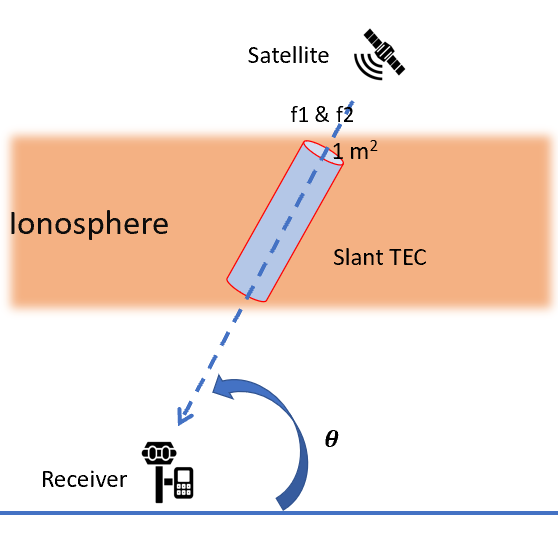
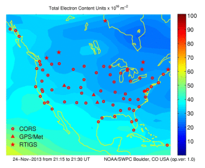
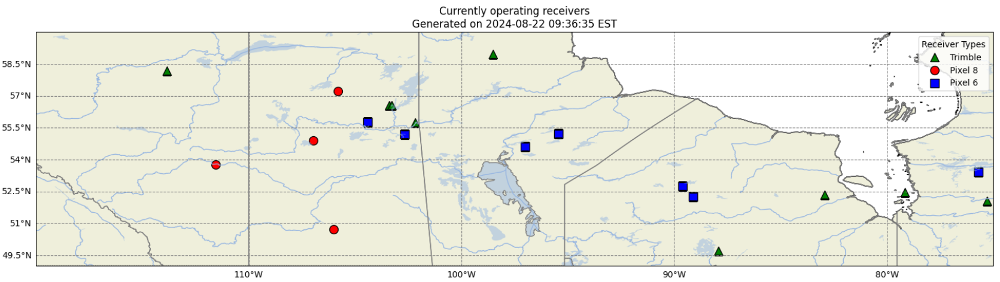
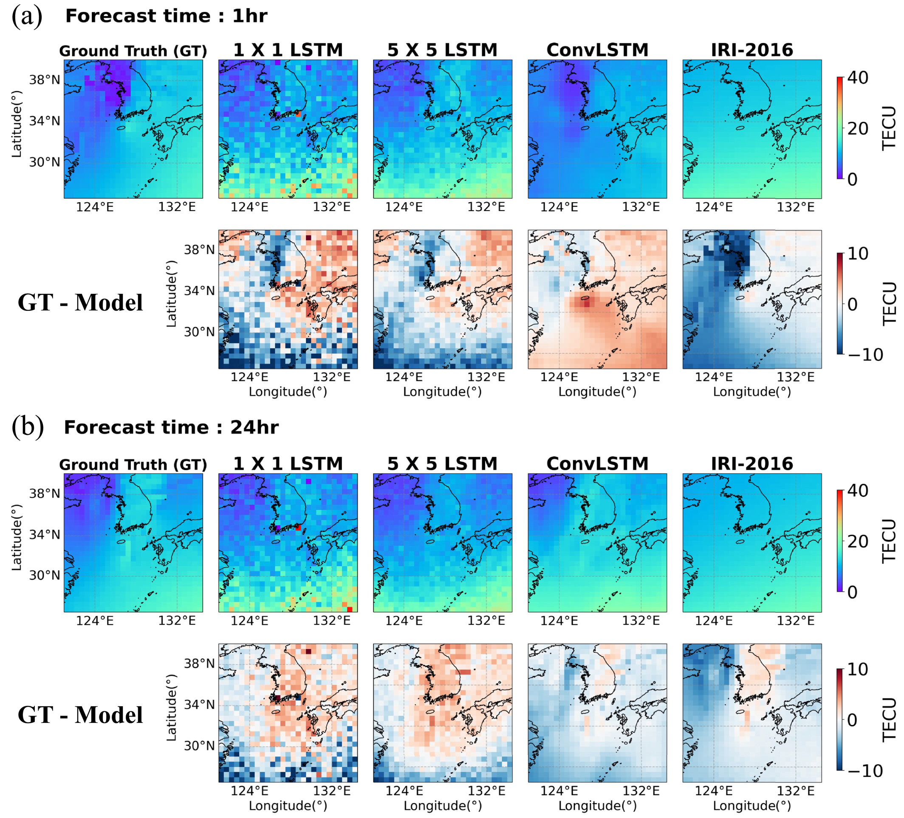
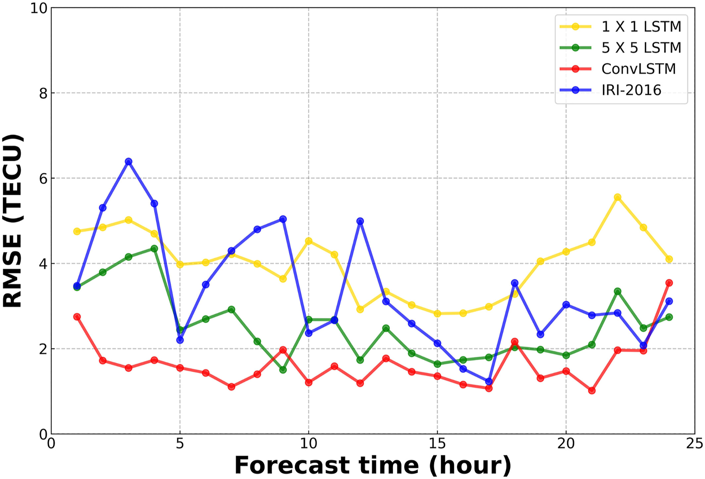
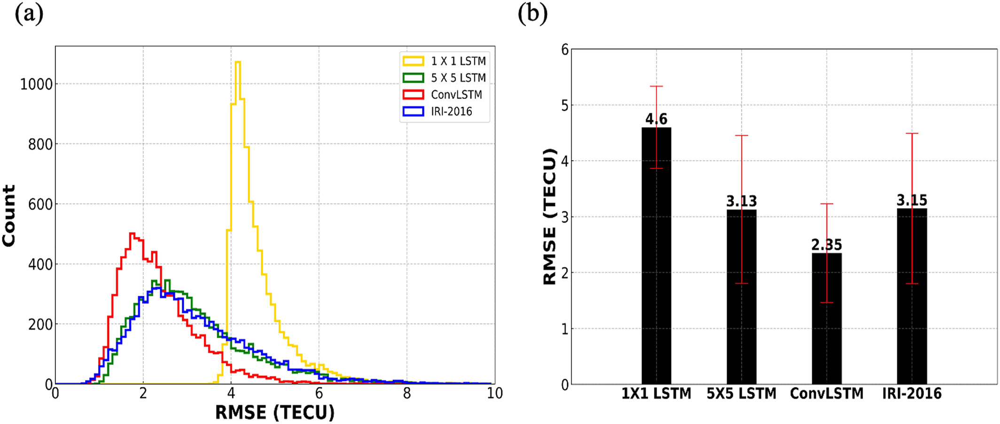

# Overview {.unnumbered}
1. [What is TEC?](#tec)
    - [Our goal](#our-goal)
    - [Current Operational Setup](#current-operational-setup)
    - [System Design](#current-system)
2. [Algorithms](#algorithms)
    - [Data Processing](#data-processing)
        - [Ionospheric Assumption Validation](#1-ionospheric-assumption-validation)
        - [Main Ionospheric Trough Identification](#2-main-ionospheric-trough-identification)
        - [RINEX conversion](#3-rinex-conversion)
        - [Analysis](#4-analysis)
## TEC
The **T**otal **E**lectron **C**ontent is the columnar number density of electrons between a satellite and a GNSS receiver.
<div style="text-align: center;">

</div>

where $$f_1=1575.42*10^6 Hz$$ (The L1 frequency) and $$f_2=1227.60*10^6 Hz$$ (The L2 frequency). 

The TEC is given by
$$TEC=\frac{f_1^2 f_2^2}{f_1^2 - f_2^2} * 10^{-16} * \frac{1}{40.309} (\phi_1-\phi_2+\epsilon)$$
where $$10^{-16}$$ is a multiplicative constant to denote it in (TECU), and $$\phi_1,\phi_2$$ are the **carrier phases/pseudoranges** and $$\epsilon$$ is the **error**. The assumption is that the ionosphere is a **cold**, **collisionless**, **magnetized** plasma.

We record the raw pseudoranges, carrier phases, signal strength, etc in GNSS receivers at certain times (every 15 seconds, 30 seconds, 1 second (high freq), etc)  along with some environmental conditions (wind speed, temperature, humidity, etc) and internal operating parameters (SNR, PDOP, VDOP, HDOP, number of satellites in contact with, uptime hours, downtime, correction latency) at roughly the same frequencies, but can be changed.

We produce **TEC maps**, for example, like this Wikipedia one:

<div style="text-align: center;">

</div>

The <span style="color: red;">red dots</span> show GNSS receiver stations in some locations in the US, and their observations are spatially interpolated.

### Our Goal

The primary objective of the BU Space Physics Lab is to enhance  geospatial infrastructure by deploying a network of low-cost GNSS stations utilizing consumer mobile devices (at the moment, Google Pixel phones) integrated with advanced environmental monitoring systems. Our specific goals are as follows:

1. **Expand GNSS Coverage and Accuracy**: Increase the spatial density and distribution of GNSS stations across Canada, particularly in remote and sparsely monitored regions, to improve the precision, accuracy, and reliability of geospatial positioning data.

2. **Optimize Cost-Efficiency through Consumer Technology**: Leverage the widespread availability and technological advancements of consumer-grade mobile devices to create a cost-effective, scalable network of GNSS stations, reducing reliance on traditional, high-cost geodetic equipment.

3. **Integrate Multidimensional Environmental Monitoring**: Combine GNSS data with environmental sensors to capture a comprehensive set of parameters, including atmospheric conditions, temperature, and humidity, enabling more robust analysis of environmental and geospatial phenomena.

4. **Advance Scientific Research and Applications**: Provide high-resolution geospatial and environmental datasets to support a broad range of scientific research, including studies on climate change, natural hazard monitoring, and precision agriculture, as well as applications in engineering and urban development.    

### Current Operational Setup





### Current System

1. **Hardware Components** ✅
   - **Consumer Mobile Devices (Google Pixels):** 
     - GNSS chips for geospatial data collection.
     - **Price:** ~$550.00 per device
   - **Environmental Sensors:**
     - **Air Quality Sensor:** Honeywell HPMA115S0-XXX Particle Sensor.
       - **Price:** ~$55.00 per unit
     - **Temperature Sensor:** Bosch BME280 Environmental Sensor.
       - **Price:** ~$10.89 per unit
     - **Humidity Sensor:** Bosch BME280 Environmental Sensor.
       - **Price:** ~$10.89 per unit
     - **Barometric Pressure Sensor:** Bosch BMP388 Barometric Pressure Sensor.
       - **Price:** ~$15.49 per unit
   - **Power Supply:** ✅
     - **Solar Panels:** Renogy 100W 12V Monocrystalline Solar Panel.
       - **Price:** ~$125.00 per unit
     - **Battery Packs:** Anker Powerhouse 200 Portable Rechargeable Battery.
       - **Price:** ~$300.00 per unit
   - **Communication Modules:** ✅
     - **Cellular Connectivity:** Quectel EC25-AF 4G LTE Module.
       - **Price:** ~$35.00 per unit
     - **Wi-Fi and Bluetooth:** Espressif ESP32 Module.
       - **Price:** ~$8.50 per unit
     - **LoRaWAN:** The Things Network (TTN) LoRaWAN Gateway.
       - **Price:** ~$150.00 per unit

   **Total Hardware Cost per Unit:** ~$1,260.77 (including tax)

2. **Data Collection Framework**
   - **GNSS Logger (GNSS & Environmental Monitoring App):** ✅
     - Platform: Android
     - Real-time GNSS data logging.
     - Sensor data logging
     - Data encryption and offline storage.
   - **Edge Computing Device:** ✅
     - **Model:** Raspberry Pi 4 Model B.
       - **Price:** ~$59.00 per unit
     - Local processing and data filtering.
     - Python scripts for data handling.
     - Local data storage on **SanDisk Extreme PRO 128GB microSDXC** card.
       - **Price:** ~$38.00 per unit

   **Total Data Collection Framework Cost per Unit:** ~$106.70 (including 10% tax)

3. **Data Transmission and Communication**
   - **MQTT Broker:** ✅
     - Tool: Eclipse Mosquitto.
       - **Price:** Free (Open-source)
   - **HTTP/HTTPS API:** ✅
     - Tool: Flask
       - **Price:** Free (Open-source, but development costs included above)

   **Total Data Transmission and Communication Cost per Unit:** ~$0 (Development cost included above)

4. **Cloud Infrastructure**
   - **Cloud Storage:** ✅
     - Tool: Amazon S3
       - **Price:** ~$0.025 per GB per month
   - **Cloud Computing:** ✅
     - Tool: AWS Lambda
       - **Price:** ~$0.20 per 1 million requests
   - **Database:** ❌
     - Tool: PostgreSQL with PostGIS extension.
       - **Price:** ~!~$0.27 per hour (RDS micro instance)

   **Estimated Operating Cost - Cloud, Data, Software Services:** ~$108.13 per unit per month (including tax)

5. **Data Engineering Pipeline**
   - **Data Ingestion:** ✅
     - Tool: Apache Kafka
       - **Price:** ~$0.13 per GB (managed service)
   - **Data Processing:** ✅
     - Tool: Apache Spark
       - **Price:** ~$0.12 per vCPU-hour (managed service)
   - **Data Quality Assurance:** ✅
     - Tool: Python

   **Total Data Engineering Pipeline Cost per Unit:** Included in cloud costs

6. **Data Visualization and Analytics**
   - **Geospatial Visualization:** ✅ (somewhat - Cartopy+Georinex+h5py)
     - Tool: Python+ArcGIS
       - **Price:** ~$1,650.00 per ArcGIS license per year (BU license)
   - **Dashboarding:** ❌
     - Tool: Grafana
       - **Price:** Free (Open-source)
   - **Advanced Analytics:** ✅
     - Tool: SageMaker
       - **Price:** ~$0.14 per hour (training) + ~$0.06 per hour (inference, including tax)

   **Total Visualization and Analytics Cost per Unit:** ~$224.00 per unit per year (including tax)

7. **Data Distribution and Sharing**
   - **Data API:** ❌
     - Tool: RESTful API.
   - **Data Catalog and Access Control:** ❌
     - Tool: AWS Glue Data Catalog
       - **Price:** $1.10 per 100,000 objects/month (including tax)

   **Total Distribution and Sharing Cost per Unit:** Included in cloud costs

8. **Maintenance and Monitoring**
   - **System Monitoring:** ❌
     - Tool: Grafana
   - **Remote Management:** ✅
     - Tool: AWS System Manager
       - **Price:** $0.11 per managed instance per hour (including tax)

   **Total Maintenance and Monitoring Cost per Unit:** ~$76.45 per unit per year (including tax)

---

#### Summary

- **Total Price per Full Device and Monitoring Setup:** ~$1,367.47 (including tax)
- **Number of Full Setups Ready:** 13

- **Total Price Until Now:** ~$17,777.11 (including tax)

- **Estimated Operating Cost - Per Unit:** ~$192.80 per unit per year (including tax)
- **Estimated Operating Cost - Cloud, Data, Software Services:** ~$108.13 per unit per month (including tax)

# Algorithms

## Data Processing

### 1. Ionospheric Assumption Validation

For speed of computation, we use **fast 2d and 3d natural neighbors interpolation** (thick large-scale structures) and **VISTA** (thick medium-scale structures) (Video Imputation with SoftImpute, Temporal smoothing and Auxiliary data) to validate the ionospheric assumption. The VISTA algorithm is shown below
<div style="text-align: center;">

</div>

The assumption is (somewhat) invalid during solar storms, geophysical storms, magnetic reconnection with solar winds, coronal mass ejections, and so on.

### 2. Main Ionospheric Trough Identification

The Main Ionospheric Trough (MIT)
<div style="text-align: center;">

</div>

#### Characteristics of the MIT:

1. Low density arc-shaped trough whose formation is unknown.
2. Forms at night due to depletion in the F-region, but it is unknown why.
3. To identify it, we use global TEC data from the Madrigal database and use computer vision to identify it in spatiotemporal maps.

#### Technique to identify the trough:

1. Grid TEC observations (1° x 1°) and smooth with averaging. (Practically, download ~50GB of data from Madrigal, store in AWS S3, chunk when using Lambda, run computations with h5py and scientific libraries on EC2 instances, and use Amazon Glue to process things with PySpark/Apache, then grid and smooth). **Problems faced:** Uneven distribution along longitude and frequency analysis not possible.
2. **Preprocess**: Discard negative values, estimate background with sliding windows to filter out diurnal/seasonal trends. Scaling up (with the proposed network) would allow implementation of band pass filters at higher resolution.
3. **Scoring**: Set up the inverse problem. Assume each preprocessed image is a linear combination of Gaussian RBFs and the weights are the image score values. The $n^{th}$ image is assumed to be $-A_n u_n+\epsilon_n$, where $u_n$ is the image we want, $A_n$ (after removing the basis columns) is a matrix with RBFs centered on the pixels of the grid, and there is some noise. We minimize the resultant image  $$u_n^* = \arg\min_{u_n} x_n^T A_n u_n + \alpha \|W_n u_n\|_2^2 + \beta R(u_n)$$. Here $x_n$ is the $n^{th}$ preprocessed image. You have standard regularizers and total variance denoising at the end.
4. **Postprocess and verify**: After this, we apply a combination of dilation and erosion to get the MIT. This is a no-ground-truth problem, so we have to compare with readings from local receivers to see if the structure exists. 

<div style="text-align: center;">

</div>

| **Metric**                      | **Value for n=10,000** | **Value for n=100,000** |
|---------------------------------|------------------------|-------------------------|
| **Execution Time (Wall-clock)** | 8 hours                 | 5 days ms                |            |
| **Memory Usage**                | 22 GB                  | 348GB|


### 3. RINEX conversion

Developed an internal Python package named `rinexpy` - looking to merge with ``georinex``:

#### rinexpy Operations

1. **Merging and Editing RINEX Files**:
   - `rinexpy` provides the ability to merge multiple RINEX files into a single output. It also allows for editing of the file contents, such as adjusting header information, modifying observation types, and managing data intervals to ensure consistency across different GNSS data sources. 

2. **Clock Jump Correction**:
   - `rinexpy` automatically detects and corrects clock jumps in GNSS observation data. This feature ensures time continuity and improves the accuracy of the GNSS data by addressing disruptions caused by clock shifts.

3. **Ionospheric Correction**:
   - `rinexpy` applies higher-order ionospheric corrections to the GNSS data, mitigating the impact of ionospheric disturbances on the accuracy of satellite positioning information.

4. **File Format Conversion**:
   - `rinexpy` supports converting BINEX and RTCM files into the RINEX format. This conversion simplifies working with GNSS data by providing a standardized format that is widely used and recognized across various platforms.

5. **Interactive RINEX File Viewer**:
   - `rinexpy` includes an interactive, web-based viewer for RINEX files. This feature allows users to visualize and analyze GNSS data efficiently, making it easier to interpret and manage the information contained in RINEX files.

#### Examples:
1. Merging files
```
from rinexpy import merge_files

# Merge multiple RINEX files into a single output
merged_file = merge_files(['file1.rnx', 'file2.rnx'], output='merged_output.rnx')

# Edit RINEX file: Change data interval and include only specific satellites
edited_file = merge_files(
    ['file1.rnx'],
    output='edited_output.rnx',
    interval=30,  # Change data interval to 30 seconds
    include_sats=['G01', 'G02']  # Include only satellites G01 and G02
)

```
2. Correcting clock jumps
```
from rinexpy import correct_clock_jumps
# Automatically detect and correct clock jumps in a RINEX file
corrected_file = correct_clock_jumps('input_file.rnx', output='corrected_output.rnx')
```
3. Ionospheric correction
```
from rinexpy import ionospheric_correction

# Apply higher-order ionospheric corrections to a RINEX file
corrected_file = ionospheric_correction('input_file.rnx', output='corrected_output.rnx')
```
4. File Format Conversion - BINEX, RTCM, etc
```
from rinexpy import convert_to_rinex

# Convert a BINEX file to RINEX format
rinex_file = convert_to_rinex('input_file.binex', output='output_file.rnx')

# Convert an RTCM file to RINEX format
rinex_file = convert_to_rinex('input_file.rtcm', output='output_file.rnx')
```
5. RINEX viewer (Georinex call)
```
from rinexpy import view_rinex # Soft Georinex call, output as interactive Matplotlib figure

# Launch an interactive viewer for a RINEX file
view_rinex('input_file.rnx')
```

### 4. Analysis

#### 1. Cycle slip correction
We design machine learning models for cycle slip correction. These are better than the heuristic 'stiching' process that may remove important TEC jumps that could identify an ionospheric phenomenon.
<div style="text-align: center;">

</div>

<div style="text-align: center;">

</div>

The technique used is **LSTM-based autoencoders**, for several reasons. 
- The Poker Flat setups are the same receiver in roughly the same area, so we are justified in using LSTM-based autoencoders for this.
- Under the assumptions that the internals of Pixel phones suffer roughly the same wear-and-tear, autoencoders are straightforward to deploy on Sagemaker and call for inference. We are looking into making cycle slip correction on-device using heuristic algorithms, but for large data, **minimal scalloping** and autoencoders are used. Caveat: we are still in the modeling stage because of the temperature dependence of recorded pseudorange on GNSS noise.

<div style="text-align: center;">

</div>

We also account for **multipath noise**, **temperature noise** (Rideout and Coster), **propagation errors**, **ionospheric delays**, and utilize **precise point positioning** to estimate slant TEC as accurately as possible.

<div style="text-align: center;">

</div>

| **LSTM-Based autoencoder metric**                      | **Low Power Receiver** | **High Power Receiver** |
|---------------------------------|------------------------|-------------------------|
| **Training Time (Wall-clock)** | 18 hours               | 10 hours                |
| **Inference time (Wall-clock)** | ~3 seconds               | ~3 seconds                |
| **Memory Usage**                | 13.5 GB                  | 27 GB                   |
| **GPU Utilization**             | 60%                    | 80%                     |
| **Disk I/O**                    | 100 MB/s               | 200 MB/s                |
| **Network Bandwidth**           | 30 MB/s                | 80 MB/s                 |
| **Model Size**                  | 247 MB                 | 332 MB                  |


#### 2. Environmental conditions

1. If a receiver fails, we use **2-layer Gaussian process regression** in order to estimate what readings of that receiver using receivers nearby. This is scalable but computationally expensive. We also use ConvLSTM fore long-time forecasting, but are looking to move to nowcasting.

<div style="text-align: center;">

</div>
<div style="text-align: center;">

</div>
<div style="text-align: center;">

</div>

2. Denoising technique: Assuming a zero-mean non-temperature-dependent noise, we do quick denoising with Haar coefficients on-device with the Raspberry Pi 4 Model B. 

#### 3. Predictive maintenence: 
We have continuous monitoring stations set up and collect the following data per station:


| **Column Name**                 | **Description**                                             | **Frequency**         |
|---------------------------------|-------------------------------------------------------------|-----------------------|
| `Receiver_ID`                   | Unique identifier for each GNSS receiver                    | Static                |
| `Location`                      | Latitude and Longitude coordinates of the receiver          | Static                |
| `Installation_Date`             | Date when the receiver was installed                        | Static                |
| `Manufacturer`                  | The manufacturer of the GNSS receiver                       | Static                |
| `Model`                         | Specific model of the GNSS receiver                         | Static                |
| `Firmware_Version`              | Firmware version currently running on the receiver          | Static/As Updated     |
| `Maintenance_Date`              | Date of the last maintenance check                          | As Updated            |
| `Temperature_C`                 | Recorded temperature at the receiver location (in Celsius)  | Hourly                |
| `Humidity_%`                    | Relative humidity at the receiver location (as a percentage)| Hourly                |
| `Precipitation_mm`              | Amount of precipitation (in millimeters)                    | Hourly                |
| `Wind_Speed_kmh`                | Wind speed at the receiver location (in km/h)               | Hourly                |
| `Solar_Radiation_Wm2`           | Solar radiation at the receiver location (in W/m²)          | Hourly                |
| `Signal_Strength_dB`            | Signal strength received by the GNSS receiver (in dB)       | Receiver Frequency    |
| `SNR_dB`                        | Signal-to-noise ratio (in dB)                               | Receiver Frequency    |
| `Number_of_Satellites`          | Number of satellites in view                                | Receiver Frequency    |
| `PDOP`                          | Position Dilution of Precision                              | Receiver Frequency    |
| `HDOP`                          | Horizontal Dilution of Precision                            | Receiver Frequency    |
| `VDOP`                          | Vertical Dilution of Precision                              | Receiver Frequency    |
| `Correction_Latency_s`          | Time delay in the correction signal (in seconds)            | Receiver Frequency    |
| `Correction_Availability_%`     | Percentage of time correction data is available             | Receiver Frequency    |
| `Uptime_Hours`                  | Total uptime of the receiver (in hours)                     | Daily                 |
| `Downtime_Hours`                | Total downtime of the receiver (in hours)                   | Daily                 |
| `Power_Consumption_W`           | Power consumption of the receiver (in watts)                | Hourly                |
| `Battery_Voltage_V`             | Battery voltage level (if applicable)                       | Hourly                |
| `Internal_Temperature_C`        | Internal temperature of the GNSS receiver (in Celsius)      | Hourly                |
| `Error_Count`                   | Total number of errors logged                               | As Occurred/Daily     |
| `Warning_Count`                 | Total number of warnings logged                             | As Occurred/Daily     |
| `Reboot_Count`                  | Number of reboots the receiver has undergone                | As Occurred           |
| `Last_Error_Code`               | Code of the last error encountered                          | As Occurred           |
| `Maintenance_Flag`              | Boolean flag indicating whether maintenance is required     | Daily/As Updated      |
| `Nearby_Interference_Sources`   | Number of known interference sources near the receiver      | Daily/As Updated      |
| `Distance_to_Base_Station_km`   | Distance to the nearest base station (in kilometers)        | Static                |
| `Antenna_Condition`             | Condition of the antenna (e.g., "Good," "Needs Replacement")| As Updated            |
| `Failed`              | Boolean | Set to 1 if no response for 24 hours|

1. **Time-series classification**: How does TEC change during an auroral event?
<div style="text-align: center;">
<video  controls>
  <source src="images/timeseriesanalysis/tecexample.mp4" type="video/mp4">
</video>
</div>

Given a dataset of time-series TEC curves at some frequencies, we want to classify them to make an **early-warning system** for auroral events (so citizen scientists can go out and take photographs!)

You can probe ionospheric conditions (such as from DMSP) and get extra time series, as shown.
<div style="text-align: center;">

</div>

a. To classify phenomena, we use two separate models. First, the method for auroral phenomenon identification.

**Method**: 
- Use 1D CNN to just raw TEC changes as STEVE, SAPS, SAID, Discrete Aurora, Continuous Aurora, etc.
- Analyze satellite flyby data in order to see what ionospheric, magnetospheric, and thermospheric parameters change in that time period (use CNN for this, but we are testing VLM finetuning), and if the event is classified into two classes by two different models, then this is a warning event. 

| **Metric**                | **1-D CNN**   | **Description**                                                                 |
|---------------------------|--------------------------|---------------------------------------------------------------------------------|
| **Accuracy**              | 0.88                     | Solid overall correctness, but room for improvement.                            |
| **Precision**             | 0.85                     | Decent true positive rate out of all positive predictions.                      |
| **Recall**                | 0.82                     | Good true positive rate, but some false negatives.                              |
| **F1 Score**              | 0.83                     | Balanced precision and recall; slight drop in handling imbalanced classes.      |
| **AUC - ROC**             | 0.89                     | Good area under the ROC curve, decent class distinction.                        |
| **Confusion Matrix**      | Mostly high diagonal values | Most predictions are correct, but some off-diagonal errors exist.            |
| **Log Loss**              | 0.35                     | Moderate cross-entropy loss; predictions could be more confident.               |
| **Balanced Accuracy**     | 0.86                     | Good average recall across classes; some class imbalance issues.                |
| **Cohen’s Kappa**         | 0.75                     | Moderate agreement between predictions and actual classes.                      |
| **MCC (Matthews Correlation Coefficient)** | 0.72   | Decent performance, some challenges with imbalanced classes.                    |
| **Top-k Accuracy**        | 0.94 for k=3             | High chance of true label being among top 3, but not perfect.                   |
| **Mean Per-Class Error**  | 0.12                     | Acceptable error rate across classes, but some inconsistency.                   |
| **Time-to-Inference**     | ~18s                    | Adequate prediction time, could be optimized for real-time applications.        |


b. Predictive Maintence:
We use **MINIROCKET** for classification, but are actively refining this - we run into a data collection problem. We are now moving onto Bayesian modeling and predictive programming, with isolation forests.  
| **Metric**                | **miniROCKET’s Value**   | **Description**                                                                 |
|---------------------------|--------------------------|---------------------------------------------------------------------------------|
| **Accuracy**              | 0.82                     | Good overall correctness, but lower than more complex models.                   |
| **Precision**             | 0.80                     | Reasonable true positive rate, with some false positives.                       |
| **Recall**                | 0.78                     | Adequate true positive rate, with more false negatives than desired.            |
| **F1 Score**              | 0.79                     | Balanced performance between precision and recall, with noticeable trade-offs.  |
| **AUC - ROC**             | 0.78                     | Decent area under the ROC curve, with good but not exceptional class distinction.|
| **Confusion Matrix**      | Moderate diagonal values | Correct predictions for the most part, but more off-diagonal errors present.    |
| **Log Loss**              | 0.45                     | Higher cross-entropy loss, indicating less confident predictions.               |
| **Balanced Accuracy**     | 0.80                     | Average recall for classes shows room for improvement, especially with imbalance.|
| **Cohen’s Kappa**         | 0.70                     | Moderate agreement, but a noticeable decline compared to stronger models.       |
| **MCC (Matthews Correlation Coefficient)** | 0.68   | Acceptable classification performance, but struggles more with imbalanced data. |
| **Top-k Accuracy**        | 0.90 for k=3             | Decent chance of true label being in the top 3, but not as strong as better models.|
| **Mean Per-Class Error**  | 0.15                     | Higher error rate across classes, indicating inconsistency.                     |
| **Time-to-Inference**     | ~5ms                     | Faster prediction time, a significant advantage in real-time applications.      |


c. Forecasting

We test Lag-LLaMa, a foundational time-series model for predicting future environmental parameters, but this is still in the very early stage.

#### STEVE
<div style="text-align: center;">

</div>


# Miscellaneous

## Computer Vision algorithms used:

We use Max-Tree for faint phenomenon identification, active learning, monocular depth estimation (Depth Prediction Transformers), and Open Set recognition to identify STEVE in citizen science images. 

The clustering model developed was to classify all-sky images of aurora  - using ResNet-18 to extract features, used PCA to reduce dimensionality, and K-Means++ to cluster. Achieved silhouette score of 0.7, Davies-Bouldin index of 0.9, Calinski-Harabase index of 256 indicating high-quality cluster separation, and better separation between clusters. 

## Life on Mars
Generated TEC maps from MARSIS data by modeling with two-layer Chapman functions for Martian ionosphere. Used VISTA to reconstruct (in 3D), 3d volumes of maps. Auxiliary guess was made using natural pixel decomposition, where the 3d structure estimated with tomography. Specifically, it is modeled as a Fredkin integral of the first kind and pLogMART is used as the matrix inversion algorithm. Simulated GPS propagation through it